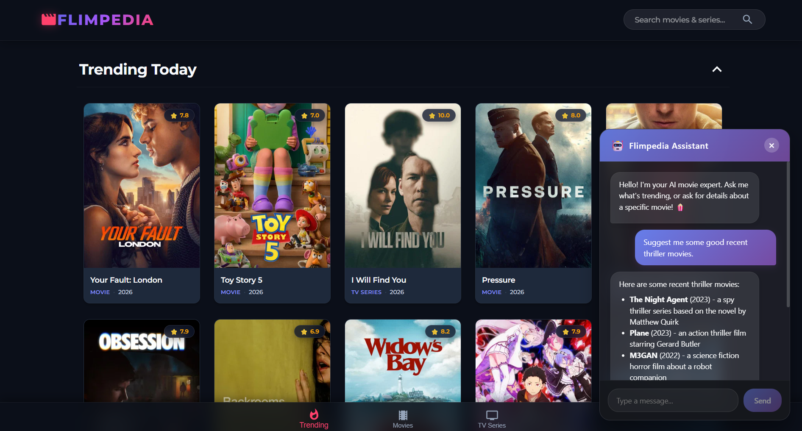

# 🎬 Flimpedia

Flimpedia is a modern, full-stack entertainment application built with React. It allows users to discover trending movies, explore TV series, search a massive global database (powered by TMDB), and interact with a live, context-aware AI Movie Assistant.



## ✨ Features
* **Global Search:** Sleek, integrated header search to find any movie or series instantly.
* **Trending & Popular:** Live updates of the hottest movies and TV shows.
* **Advanced Filtering:** Filter content by specific Genres and Languages.
* **Premium UI:** Glassmorphism styling, vibrant gradients, and a responsive layout that looks great on mobile and desktop.
* **AI Movie Assistant (MCP):** A floating, intelligent chatbot powered by the Model Context Protocol. It has live access to the TMDB database to answer questions, give recommendations, and fetch real-time data!

## 🚀 Technology Stack
* **Frontend:** React.js, Material-UI, React-Router, React-Markdown
* **Backend:** Node.js, Express.js
* **AI & Data:** Groq (Llama-3), Model Context Protocol (MCP) SDK, TMDB API

---

## 🛠️ How to Run Locally

Because Flimpedia uses an AI Assistant with live internet access, it is a **Full-Stack Application** requiring both the frontend and backend to run simultaneously.

### 1. Prerequisites
You will need API keys for:
* [TMDB (The Movie Database)](https://www.themoviedb.org/documentation/api)
* [Groq Cloud](https://console.groq.com/keys)

### 2. Setup the Backend (AI & MCP Server)
The backend acts as the "Brain" and the bridge to the database.
```bash
cd mcp-server
npm install
```
* Create a `.env` file in the `mcp-server` folder and add your keys:
  ```env
  TMDB_API_KEY=your_tmdb_key_here
  GROQ_API_KEY=your_groq_key_here
  ```
* Compile and start the server:
  ```bash
  npx tsc
  node server.js
  ```
*(The backend will now be running on `http://localhost:3001`)*

### 3. Setup the Frontend (React App)
Open a **new terminal window** and run the React frontend:
```bash
# Return to the root folder
cd ..
npm install
```
* Create a `.env` file in the root folder for the frontend:
  ```env
  REACT_APP_API_KEY=your_tmdb_key_here
  ```
* Start the React app:
  ```bash
  npm start
  ```
*(The frontend will now be running on `http://localhost:3000`)*

---

## 🧠 How the AI Assistant Works (Model Context Protocol)
Flimpedia uses the revolutionary **Model Context Protocol (MCP)** to give the AI real-world tools. 

Instead of relying on outdated training data, the Groq LLM connects to our custom `mcp-server/index.ts`. When you ask *"What's trending?"*, the AI intelligently pauses, triggers the `get_trending_movies` tool to fetch live data from TMDB, and then formats the answer beautifully using Markdown in the UI!
